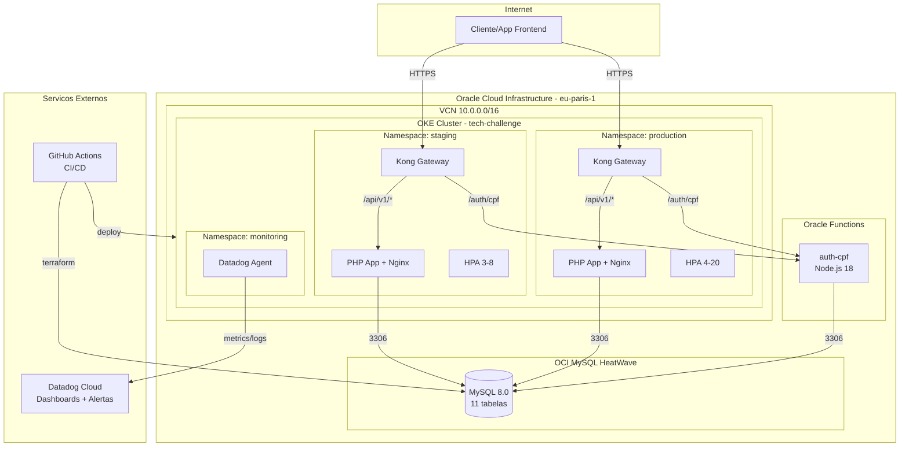
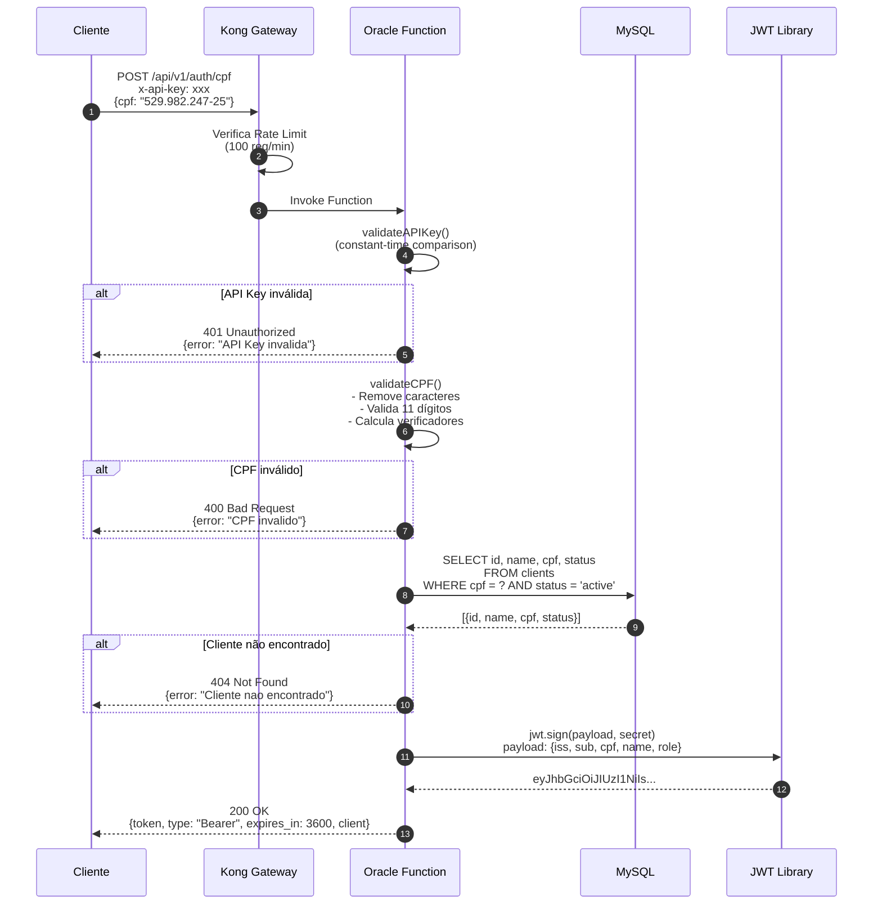
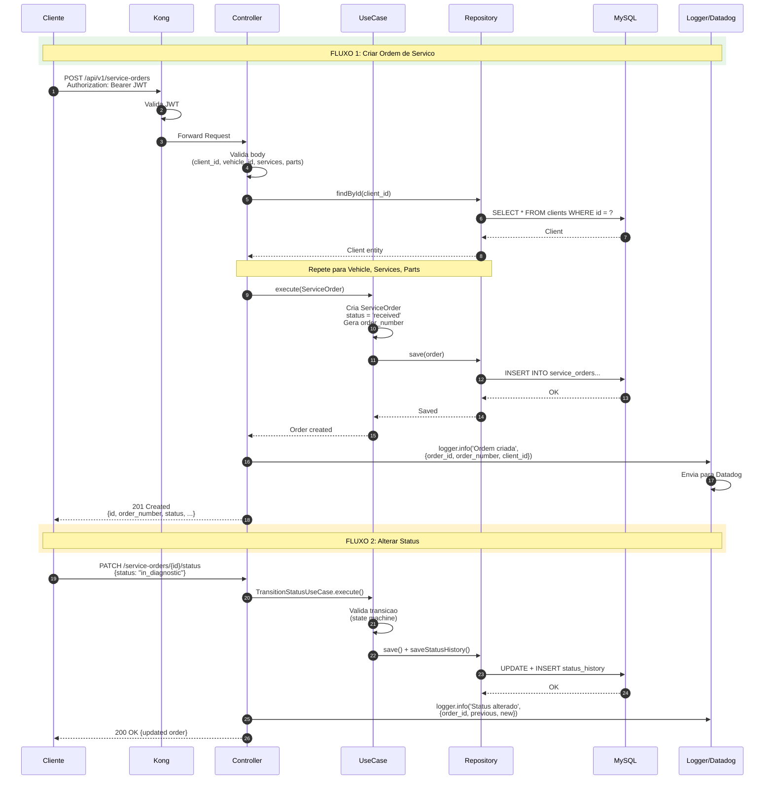
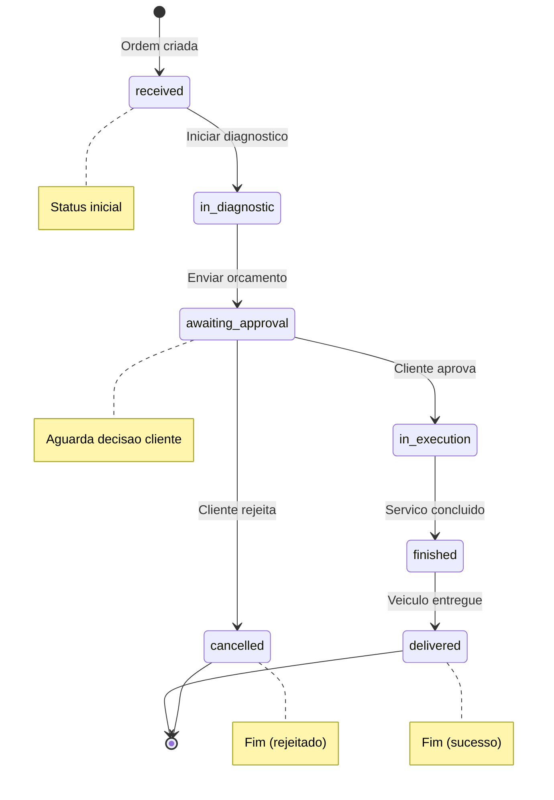
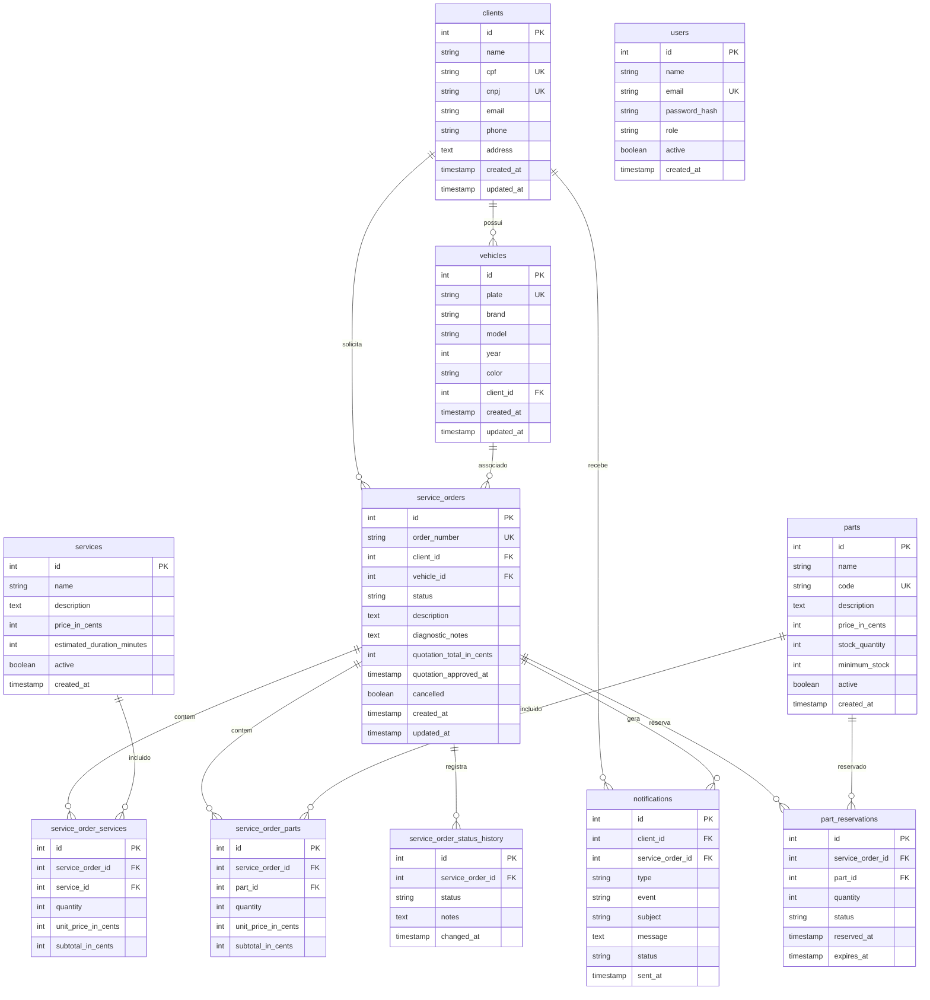
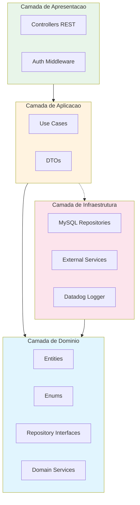
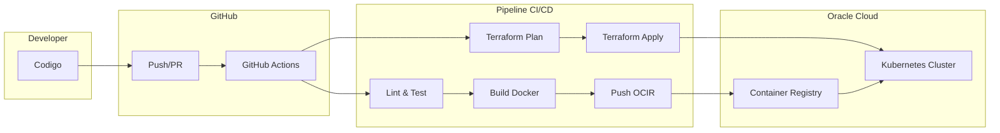

# Tech Challenge - Documentacao Arquitetural

Documentacao arquitetural completa do projeto Tech Challenge FIAP - Sistema de Gerenciamento de Ordens de Servico para Oficina Mecanica.

## Repositorios do Projeto

| Repositorio | Descricao | Status |
|-------------|-----------|--------|
| [tech-challenge-app](https://github.com/brunaminusso/tech-challenge-app) | Aplicacao principal PHP (Slim 4 + DDD) |  |
| [tech-challenge-serverless](https://github.com/brunaminusso/tech-challenge-serverless) | Oracle Function para autenticacao por CPF |  |
| [tech-challenge-infra-k8s](https://github.com/brunaminusso/tech-challenge-infra-k8s) | Infraestrutura Kubernetes (Terraform + OKE) |  |
| [tech-challenge-infra-db](https://github.com/brunaminusso/tech-challenge-infra-db) | Infraestrutura Banco de Dados (Terraform + OCI MySQL) |  |

---

## Diagramas

### Diagrama de Componentes

Visao geral da arquitetura de nuvem, incluindo APIs, banco de dados e monitoramento.

### Diagrama de Sequencia - Autenticacao por CPF

Fluxo completo de autenticacao usando CPF como identificador.

### Diagrama de Sequencia - Ordens de Servico

Fluxo de criacao e transicao de status das ordens.

### Maquina de Estados - OrderStatus

### Diagrama Entidade-Relacionamento (ER)

Modelo relacional completo com 11 tabelas.

---

## RFCs (Request for Comments)

Documentos que descrevem decisoes tecnicas relevantes do projeto.

| RFC | Titulo | Status |
|-----|--------|--------|
| [RFC-001](rfcs/RFC-001-escolha-nuvem.md) | Escolha da Nuvem (OCI) | Aceito |
| [RFC-002](rfcs/RFC-002-escolha-banco-dados.md) | Escolha do Banco de Dados (MySQL) | Aceito |
| [RFC-003](rfcs/RFC-003-estrategia-autenticacao.md) | Estrategia de Autenticacao (JWT + CPF) | Aceito |

### Resumo das Decisoes

#### Por que Oracle Cloud Infrastructure?
- **Always Free Tier permanente** com 4 OCPUs ARM e 24GB RAM
- MySQL HeatWave incluso gratuitamente
- Oracle Functions com 5M invocacoes/mes gratis
- OKE (Kubernetes) compativel com padroes

#### Por que MySQL 8.0?
- Incluso no OCI Free Tier
- Compatibilidade nativa com PHP (PDO)
- Modelo relacional adequado para o dominio
- Precos em centavos para evitar problemas de precisao

#### Por que JWT com CPF?
- Autenticacao stateless e escalavel
- CPF como identificador natural brasileiro
- Function serverless isolada (menor surface attack)

---

## ADRs (Architecture Decision Records)

Registros de decisoes arquiteturais permanentes.

| ADR | Titulo | Status |
|-----|--------|--------|
| [ADR-001](adrs/ADR-001-uso-hpa.md) | Uso de Horizontal Pod Autoscaler (HPA) | Aceito |
| [ADR-002](adrs/ADR-002-kong-api-gateway.md) | Kong como API Gateway | Aceito |
| [ADR-003](adrs/ADR-003-arquitetura-ddd.md) | Arquitetura DDD com Clean Architecture | Aceito |
| [ADR-004](adrs/ADR-004-datadog-observabilidade.md) | Datadog para Observabilidade | Aceito |

### Decisoes Arquiteturais Chave

| Decisao | Escolha | Alternativas Rejeitadas |
|---------|---------|-------------------------|
| Autoscaling | HPA (CPU/Memory) | KEDA, Replicas estaticas |
| API Gateway | Kong (DB-less) | Traefik, Istio, AWS API GW |
| Arquitetura | DDD + Clean Architecture | MVC tradicional, Hexagonal |
| Monitoramento | Datadog | Prometheus+Grafana, New Relic |

---

## Arquitetura DDD - Camadas

---

## Stack Tecnologica

### Aplicacao
| Componente | Tecnologia |
|------------|------------|
| Linguagem | PHP 8.2 |
| Framework | Slim Framework 4 |
| ORM | Doctrine DBAL |
| Arquitetura | DDD + Clean Architecture |

### Infraestrutura
| Componente | Tecnologia |
|------------|------------|
| Cloud | Oracle Cloud Infrastructure (OCI) |
| Kubernetes | OKE (Oracle Kubernetes Engine) |
| IaC | Terraform >= 1.5.0 |
| API Gateway | Kong (DB-less) |

### Dados
| Componente | Tecnologia |
|------------|------------|
| Banco de Dados | MySQL 8.0 (OCI HeatWave) |
| Cache | (Planejado: Redis) |

### Observabilidade
| Componente | Tecnologia |
|------------|------------|
| APM | Datadog |
| Logs | Datadog Logs (JSON estruturado) |
| Metricas | Datadog Metrics |
| Alertas | Datadog Monitors + PagerDuty |

### CI/CD
| Componente | Tecnologia |
|------------|------------|
| Pipelines | GitHub Actions |
| Registry | Oracle Container Registry (OCIR) |
| Deploy | Terraform + kubectl |

---

## Pipeline CI/CD

---

## Video de Demonstracao

**Link:** [YouTube - Tech Challenge Demo](https://youtube.com/...)

**Conteudo do Video:**
1. Autenticacao com CPF (Oracle Function)
2. Pipeline CI/CD em execucao
3. Deploy automatizado para OKE
4. Consumo das APIs protegidas via Kong
5. Dashboard Datadog com metricas ao vivo
6. Logs e traces em tempo real

---

## Equipe

- **Aluno:** Bruna Minusso
- **Curso:** Pos-Graduacao FIAP
- **Fase:** Tech Challenge

---

## Licenca

Este projeto foi desenvolvido como parte do Tech Challenge FIAP.
